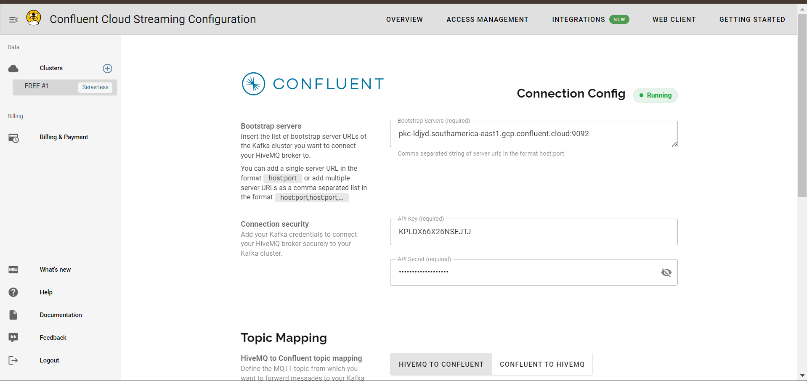
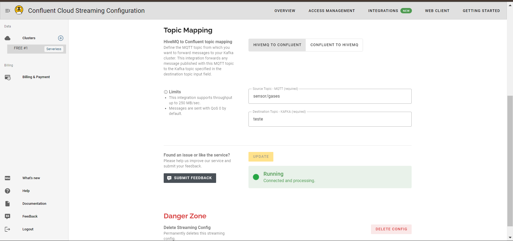
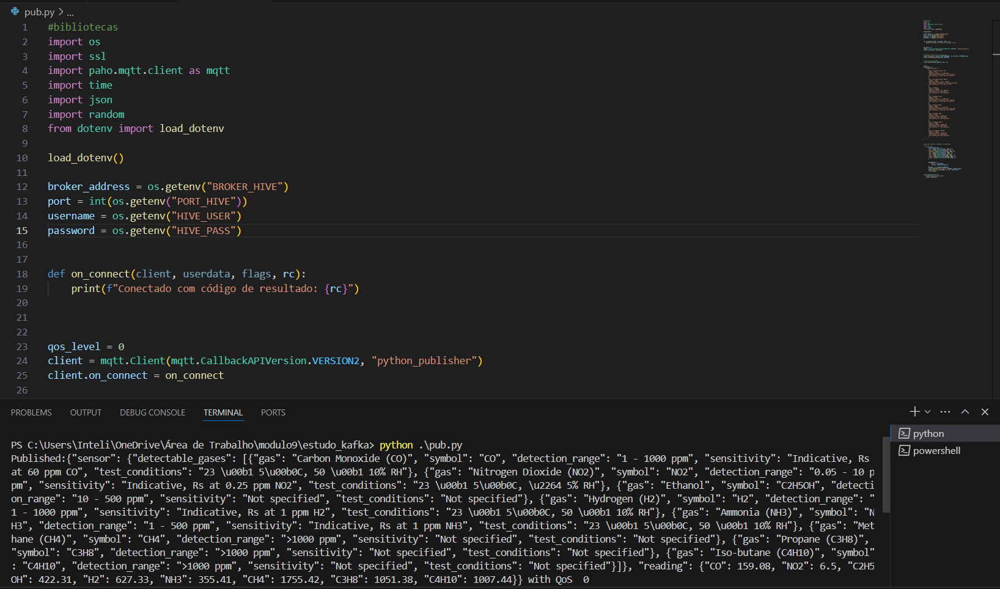
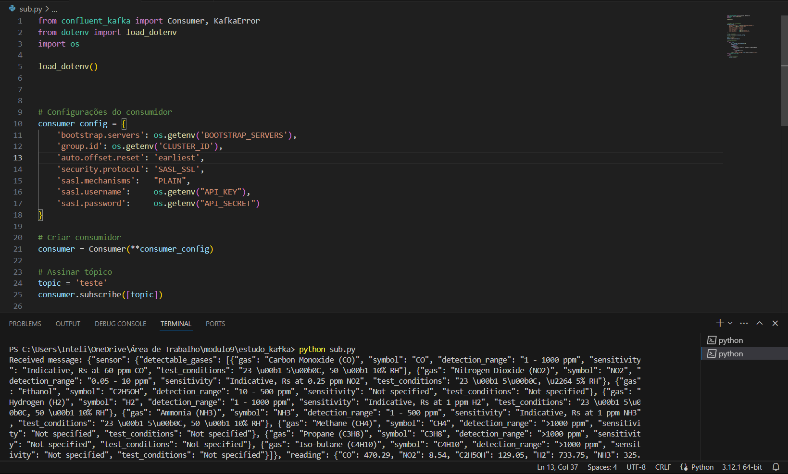
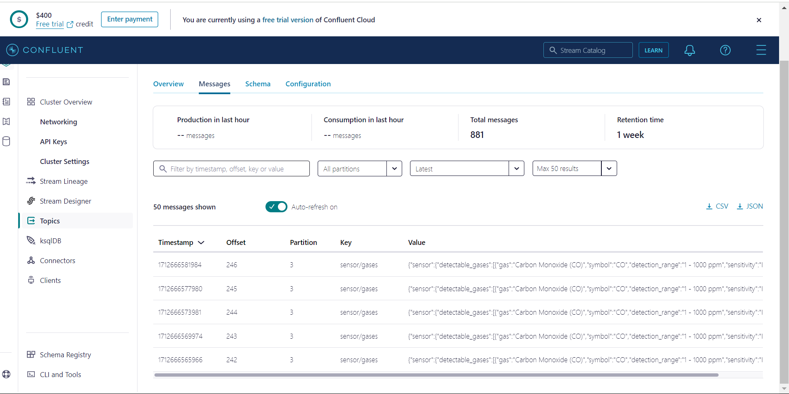

# Integração do HiveMQ com Kafka e Modificação do subscriber para ser um consumer 

###### AUTOR: ALYSSON C. C. CORDEIRO
###### engenheiro da computação - inteli - m9

### Pré-requisito:

- Python 3.x instalado
- Conta no HiveMQ
- Conta na plataforma Confluent Cloud

### Instalação:

1. Clone este repositório:

```python
git clone https://github.com/alyssoncastro/ponderada_kafka.git
```

2. Instale as dependencias de bibliotecas:

```python
pip install confluent_kafka paho-mqtt python-dotenv
```

### Configuração:

1. Crie um arquivo `.env` na raiz do projeto e adiciones suas credenciais:

```python
API_KEY=sua_api_key
API_SECRET=sua_api_secret
BOOTSTRAP_SERVERS=endereço_servidor_kafka
CLUSTER_ID=id_grupo_kafka
```

Substitua `sua_api_key`, `sua_api_secret`, `endereço_servidor_kafka` e `id_grupo_kafka` pelas suas próprias credenciais e informações do Kafka.

A do HiveMQ também:

```python
BROKER_HIVE=' '
PORT_HIVE=' '
HIVE_USER=' '
HIVE_PASS=' '
```

Mas vale lembrar que depois de fazer isso, integre o HIVEMQ com Confluent Cloud.

Então, vá no HiveMQ em `integration` e clique em `Confluent`. Lá você econtrará alguns campos de preencimentos. 
Coloque suas credenciais em cada campo correspondente, as quais estão na `.env`:

```python
BOOTSTRAP_SERVERS=endereço_servidor_kafka
API_KEY=sua_api_key
API_SECRET=sua_api_secret
```



Depois coloque o tópico que está no publisher. No meu está "sensor/teste". E coloca o nome do tópico que será destinado o tópico do KAFKA: "teste". E clicar em "Executar"



### Execução:

1. Em terminal rode:

```python
python pub.py
```



2. Abra outro terminal para o subscriber:

```python
python sub.py
```



2. Vá para o Confluent Cloud, entre em  Enviromments > Default > Cluster (será o nome do seu cluster) > Topics > Clica no tópico que você colocou no no HiveMQ, no caso é "teste". Agora vá em messages. Pronto você consumindo suas informações:




### vídeo:

 ###### obs: fiz dois porque a gração do aplicativo não suporta té 50 segundos aproximadamente:

[](https://drive.google.com/file/d/1WgR4WlRwoYhiOBdPaYM00V70V4vl9RjQ/view?usp=drive_link)


video 2

[](https://drive.google.com/file/d/1Fr7TvidJK3wzsjlTkN2BEbVaFzUfgvhs/view?usp=drive_link)


